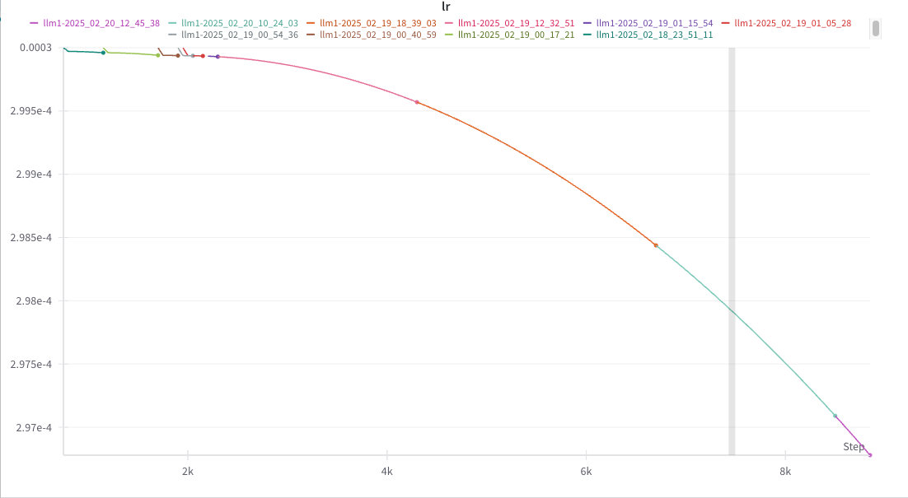
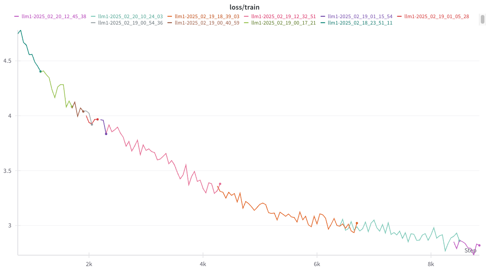
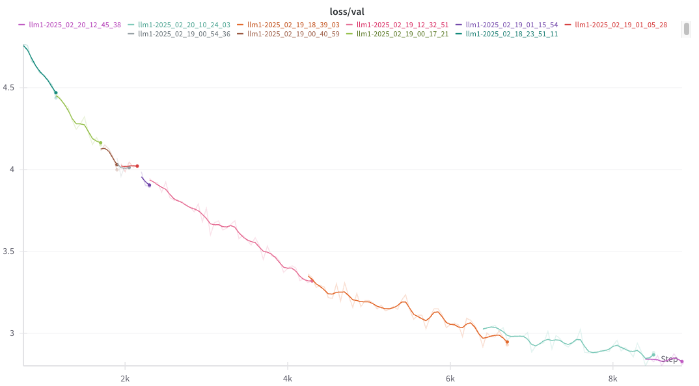

# Custom GPT Pretraining on Wiki Data

This repository contains the code and model weights for a custom GPT model developed from scratch and pretrained on Wikipedia data. The model comprises **19.8 Million parameters** and is designed for text generation and language modeling tasks.

## Overview


- **Pretraining Data:** Wikipedia dataset (preprocessed).
- **Parameter Count:** 19.8 Million parameters.  
- **Device:**  M2
- **Batch Size:** 32  
- **Context Length:**  512  
- **Embedding Size:**  384  
- **Transformer Blocks:** 7    
- **No. of heads:** 7  


## Repository Structure

    .  
    ├── metrics
    ├── src  
    │   ├── config.py  
    │   ├── gpt.py  
    │   ├── layers.py  
    │   ├── load_data.py  
    │   └── utils.py      
    ├── train.py
    ├── requirements.txt
    ├── .gitignore  
    └── README.md                

## Installation

1. Clone the repository:
   ```bash
   git clone https://github.com/your-username/custom-gpt.git
   cd custom-gpt

2. Install requirements:  

    ```bash
    pip install -r requirements.txt

3. Train the model from scratch:  

    ```bash
    python train.py

## Learning Rate and Loss Evolution

**LR**  **Train Loss**  **Val Loss**    
